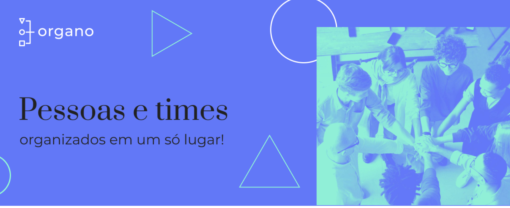
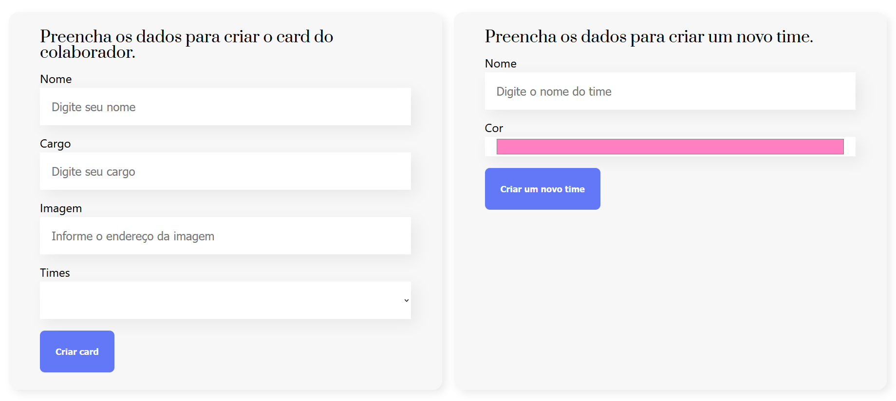
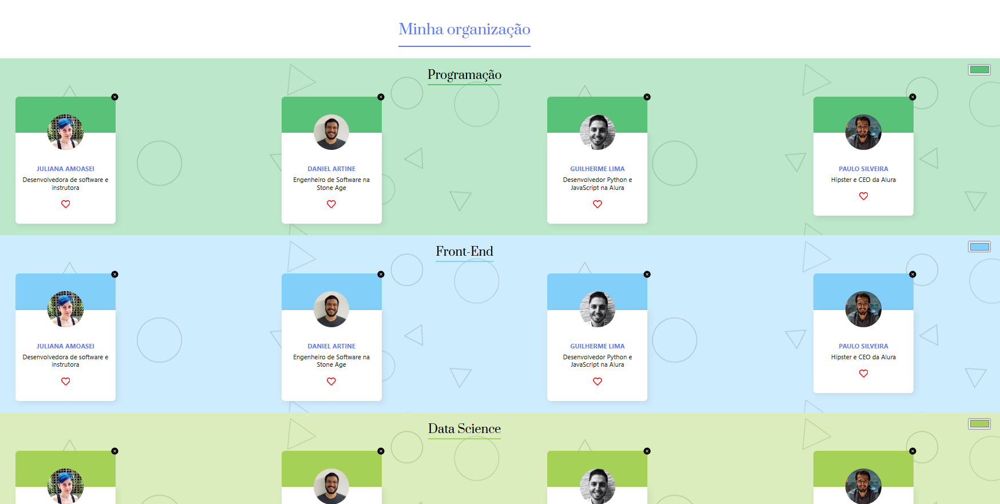

## 🏢 Organo

O **Organo** é uma aplicação desenvolvida em **React**, criada para **organizar os times de uma empresa**, permitindo **criar times** e **cadastrar colaboradores com nome, cargo, imagem e time**. Nesta continuação, o projeto foi expandido durante o curso da Alura para aprofundar conceitos de **funcionamento interno dos componentes, explorando props, states, one-way data binding e Virtual DOM**.

 

## 🚀 Sobre o Projeto

Este projeto foi desenvolvido durante o curso da Alura:

* "React: como os componentes funcionam"
  
O foco foi compreender como o **React enxerga os componentes, seus props e states**, além de praticar **refatorações, criação de novas funcionalidades** e analisar como o **one-way data binding e o Virtual DOM** influenciam o funcionamento da aplicação.

## 📚 Objetivos do Curso

* Aprender a clonar um projeto existente no GitHub, instalar as dependências necessárias e rodar o código;
* Entender o que são **dependências** e como instalar novas dependências;
* Comparar como o React vê um **componente**, assim como seus **props e states**;
* Fazer mudanças no código, como criação de **novas features e refatoração de código existente**;
* Saber o que é **one-way data binding**, e o que isto tem a ver com **VirtualDOM (e por que o React é feito desta forma)**.

## 🛠️ Tecnologias Utilizadas

  

## 🖼️ Visualização do Projeto

Uma prévia das principais funcionalidades do **Organo**:

**🌐 Acesse o Projeto Online**

O projeto está disponível para visualização na **Vercel**. Clique no link abaixo para acessar:

**📌 Banner da Aplicação**

Área inicial que exibe o banner principal do Organo, trazendo destaque visual e identidade da aplicação.

**📨 Página do Projeto**

Página onde os colaboradores e times podem ser cadastrados, informando informações principais sobre eles, sendo exibidos de forma organizada por grupo.

**👥 Times da Empresa**

Seção onde os colaboradores são exibidos de forma organizada por time, facilitando a visualização da equipe e o entendimento da estrutura da empresa.

